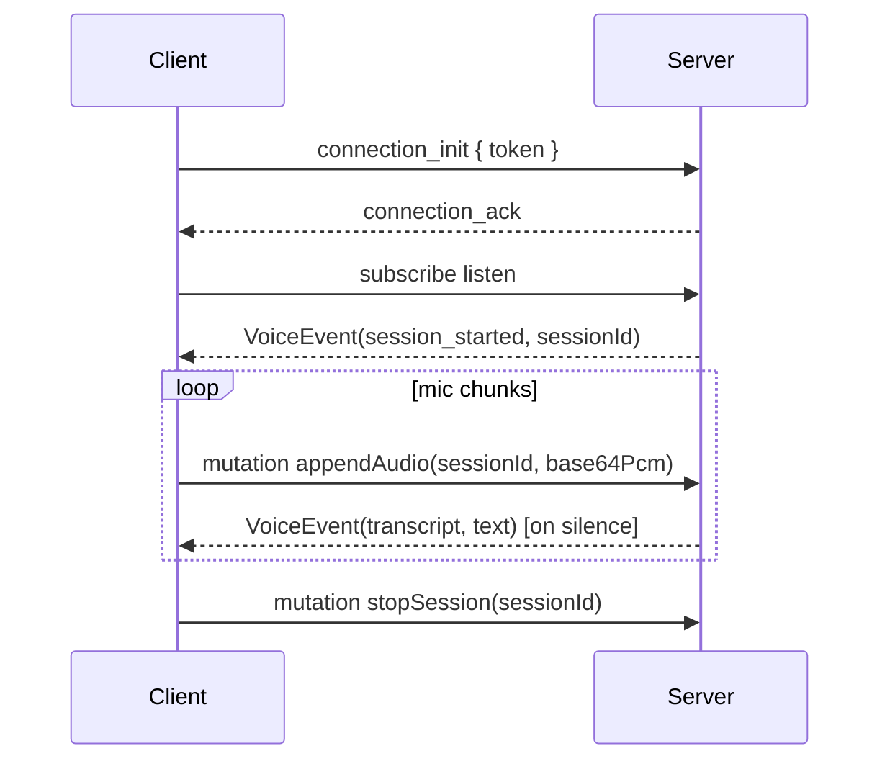

# vad-proxy front-end integration

This document describes how browser and mobile clients stream microphone audio to
**vad-proxy** over a single GraphQL WebSocket endpoint and receive live
transcripts.

## Endpoint

| Environment | URL |
|-------------|-----|
| Local dev | `ws://127.0.0.1:8080/graphql` |
| Production | `wss://voice.biosystems.dev/graphql` |

Protocol: **`graphql-transport-ws`** (the modern subprotocol used by the npm
[`graphql-ws`](https://github.com/enisdenjo/graphql-ws) client).

## Authentication

When `VAD_PROXY_AUTH_TOKEN` is set on the server, clients must pass the same
value during the WebSocket handshake:

```js
import { createClient } from "graphql-ws";

const client = createClient({
  url: "wss://voice.biosystems.dev/graphql",
  connectionParams: { token: YOUR_TOKEN },
});
```

If the token is missing or wrong, the server closes the socket with code **4403
Forbidden** before any subscription starts.

## GraphQL schema

```graphql
type VoiceEvent {
  kind: String!             # "session_started" | "transcript"
  sessionId: ID
  text: String
  turnComplete: Boolean
  endPhrase: Boolean
  startSecs: Float
  endSecs: Float
  sttBackend: String
}

type Mutation {
  appendAudio(sessionId: ID!, audioBase64: String!): Boolean!
  endUtterance(sessionId: ID!): Boolean!
  stopSession(sessionId: ID!): Boolean!
}

type Subscription {
  listen(sampleRate: Int = 16000): VoiceEvent!
}
```

### Field notes

- **`appendAudio`**: base64-encoded **mono signed 16-bit little-endian PCM** at
  **16 kHz** (2 bytes per sample). Send ~100–250 ms chunks for low latency.
- **`endUtterance`**: forces the VAD segmenter to flush any in-progress
  utterance (useful when the user taps “stop talking”).
- **`listen`**: creates a new session. The **first** event is always
  `kind: "session_started"` with a `sessionId`. Subsequent events are
  `kind: "transcript"` with the refined text.

## Client flow



1. Open the WebSocket with `connectionParams.token`.
2. Subscribe to `listen`.
3. Read `sessionId` from the `session_started` event.
4. Capture mic audio, resample to 16 kHz mono Int16, base64-encode, call
   `appendAudio` repeatedly.
5. Render `transcript` events as they arrive.
6. Call `stopSession` (or close the socket) when done.

## Microphone capture and resampling

Browsers record at the device’s native rate (typically **44.1 kHz** or **48 kHz**)
as **Float32** samples. The server expects **16 kHz mono Int16 PCM**.

You must:

1. `navigator.mediaDevices.getUserMedia({ audio: true })`
2. Create an `AudioContext` (or `OfflineAudioContext`) at the capture rate.
3. Downsample to **16 kHz** (e.g. `AudioWorklet`, linear interpolation, or
   `OfflineAudioContext` with `sampleRate: 16000`).
4. Convert Float32 `[-1, 1]` → Int16 `[-32768, 32767]`.
5. `btoa(String.fromCharCode(...new Uint8Array(pcm.buffer)))` or a proper
   base64 helper for large buffers.

See **`examples/browser-voice/index.html`** for a zero-dependency HTML reference
implementation, or **`frontend/`** (Voice Lab) for the full local dev UI:

```bash
cd frontend && npm install && npm run dev
```

## Example subscription (graphql-ws)

```graphql
subscription Listen {
  listen(sampleRate: 16000) {
    kind
    sessionId
    text
    turnComplete
    endPhrase
    startSecs
    endSecs
    sttBackend
  }
}
```

## Example mutations

```graphql
mutation Append($sessionId: ID!, $audio: String!) {
  appendAudio(sessionId: $sessionId, audioBase64: $audio)
}

mutation End($sessionId: ID!) {
  endUtterance(sessionId: $sessionId)
}

mutation Stop($sessionId: ID!) {
  stopSession(sessionId: $sessionId)
}
```

Over `graphql-transport-ws`, send mutations as one-shot `subscribe` messages
(the `graphql-ws` client handles this automatically).

## Wiring into organism (deferred)

The organism front-end currently uses REST + SSE for voice
(`references/organism/frontend/src/hooks/useVoiceChat.ts`,
`lib/constants.ts`). A future pass would:

1. Add `VOICE_GRAPHQL_WS_URL` to `lib/constants.ts` pointing at
   `wss://voice.biosystems.dev/graphql`.
2. Replace or complement `liveTranscriber.ts` with a `graphql-ws` client using
   the flow above.
3. Map `VoiceEvent` transcripts into the existing chat message state in
   `useVoiceChat.ts`.
4. Store the shared auth token in the same secrets mechanism used for other API
   keys (never commit it).

This repository ships the server, protocol contract, and browser demo only;
organism edits are intentionally out of scope for the initial GraphQL rollout.

## Health check

```bash
curl https://voice.biosystems.dev/health
```

Returns JSON including `sample_rate`, `stt_backend`, and
`graphql_auth_required`.
