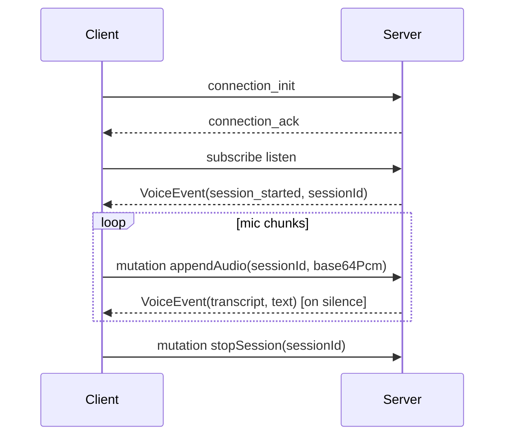

# vad-proxy front-end integration

This document describes how browser and mobile clients stream microphone audio to
**vad-proxy** over a single GraphQL WebSocket endpoint and receive live
transcripts.

## Endpoint

| Environment | URL |
|-------------|-----|
| Local dev | `ws://127.0.0.1:8080/graphql` |
| Production | `wss://voice.biosystems.dev/graphql` |

Protocol: **`graphql-transport-ws`** (the modern subprotocol used by the npm
[`graphql-ws`](https://github.com/enisdenjo/graphql-ws) client).

## Access control

Browser clients are allowed when their `Origin` header matches an entry in
`VAD_PROXY_ALLOWED_ORIGINS`, or when the page is served from **localhost** /
**127.0.0.1** (any port — local Voice Lab works out of the box).

Configure allowed origins in `.env`:

```bash
# Comma-separated full browser app URLs (scheme + host + port if non-default).
VAD_PROXY_ALLOWED_ORIGINS=https://biosystems.dev
```

When `VAD_PROXY_VOICE_API_KEY` is set, clients connecting from **non-localhost**
origins (or without an `Origin` header, e.g. scripts) must pass the same value
in GraphQL `connectionParams`:

```js
import { createClient } from "graphql-ws";

const client = createClient({
  url: "wss://voice.biosystems.dev/graphql",
  connectionParams: { apiKey: process.env.VOICE_API_KEY },
});
```

| `VAD_PROXY_VOICE_API_KEY` | Origin | API key required |
|---------------------------|--------|------------------|
| unset | any | No (dev default) |
| set | localhost / 127.0.0.1 | No (Voice Lab local dev) |
| set | allowed production origin | Yes (`connectionParams.apiKey`) |
| set | missing (scripts) | Yes (`connectionParams.apiKey`) |

If the origin is not allowed or the API key is missing/invalid when required,
the server closes the socket with code **4403 Forbidden** before any
subscription starts.

> **Note:** The legacy raw PCM endpoint `/ws` is **deprecated**. New integrations
> should use `/graphql` only. Connections to `/ws` receive a deprecation message
> and close with code **1008**.

### Session limits

The server caps concurrent `listen` subscriptions via `VAD_PROXY_MAX_SESSIONS`
(default **10**). When the cap is reached, new subscriptions fail immediately
with a GraphQL error — no `session_started` event is emitted.

Idle sessions (connected but no audio) are allowed: they incur no STT or LLM
cost. Cleanup happens when the client disconnects or calls `stopSession`.

Check `/health` for `max_sessions`, `active_sessions`, and `vad_model_loaded`.

The Silero VAD ONNX model is loaded and warmed up **once per server process**.
Each `listen` subscription gets its own isolated stream state (recurrent LSTM
buffers); session connect does not reload the model.

## GraphQL schema

```graphql
type VoiceEvent {
  kind: String!             # "session_started" | "transcript" | "chunk_debug" | "error"
  sessionId: ID
  text: String
  turnComplete: Boolean
  endPhrase: Boolean
  startSecs: Float
  endSecs: Float
  sttBackend: String
  interim: Boolean          # true for live raw STT while speaking (no LLM)
  message: String           # error detail when kind is "error"
  fatal: Boolean            # true when the session is ending due to the error
}

type Mutation {
  appendAudio(sessionId: ID!, audioBase64: String!): Boolean!
  endUtterance(sessionId: ID!): Boolean!
  stopSession(sessionId: ID!): Boolean!
}

type Subscription {
  listen(sampleRate: Int = 16000): VoiceEvent!
}
```

### Field notes

- **`appendAudio`**: base64-encoded **mono signed 16-bit little-endian PCM** at
  **16 kHz** (2 bytes per sample). Send ~100–250 ms chunks for low latency.
- **`endUtterance`**: forces the VAD segmenter to flush any in-progress
  utterance (useful when the user taps “stop talking”).
- **`listen`**: creates a new session. The **first** event is always
  `kind: "session_started"` with a `sessionId`. Subsequent events are
  `kind: "transcript"` with the refined text.
- **`sampleRate`**: must match the server's `sample_rate` from `/health`
  (default **16000**). Resample mic audio to that rate before calling
  `appendAudio`. Silero supports 8000 and 16000 Hz, but the server runs at
  whatever `VAD_PROXY_SAMPLE_RATE` is configured. A mismatched `sampleRate`
  fails the subscription immediately with a GraphQL error — no session is
  created.
- **`interim`**: when `VAD_PROXY_INTERIM_ENABLED=true`, the server may emit
  additional `transcript` events with `interim: true` while the user is still
  speaking. These carry **raw STT text** (joined chunk transcripts so far) and
  are **not** LLM-polished. Interim slice STT runs in background tasks so
  `appendAudio` keeps draining the input queue while Deepgram transcribes.
  The final `transcript` for the turn has `interim: false` (default) and
  replaces the live line in the UI.
- **Smart chunking** (default when interim is on): slices are cut on brief RMS
  dips between words after a minimum buffer (`VAD_PROXY_INTERIM_MIN_SECS`, default
  `0.5`), capped at `VAD_PROXY_INTERIM_SECS` (max slice). Tunables:
  `VAD_PROXY_INTERIM_DIP_RATIO`, `VAD_PROXY_INTERIM_DIP_HOLD_SECS` (default
  `0.04`), `VAD_PROXY_INTERIM_SMART=false` restores fixed-width chunks. Preview
  boundaries with `python scripts/preview_interim_chunks.py your-sample.mp3`.
  Full tuning guide: [docs/TUNING.md](TUNING.md).
- **Chunk debug** (`VAD_PROXY_DEBUG_INTERIM_CHUNKS=true`, interim on): after each
  turn the server emits a `chunk_debug` event with per-slice WAV audio, STT text,
  timestamps, and cut reason (`dip` / `max` / `tail`). Voice Lab shows replay
  controls for each slice. Under outbound queue pressure, `chunk_debug` may be
  omitted and a non-fatal `error` event is emitted instead (dev-only).
- **`error`**: pipeline or session failures. `message` describes what happened.
  `fatal: false` means a single STT slice was skipped (session continues).
  `fatal: true` means the session consumer crashed and the subscription will
  end — reconnect the client.

## Client flow



1. Open the WebSocket (browser sends `Origin` automatically).
2. Subscribe to `listen`.
3. Read `sessionId` from the `session_started` event.
4. Capture mic audio, resample to 16 kHz mono Int16, base64-encode, call
   `appendAudio` repeatedly.
5. Render `transcript` events as they arrive.
6. Call `stopSession` (or close the socket) when done.

## Microphone capture and resampling

Browsers record at the device’s native rate (typically **44.1 kHz** or **48 kHz**)
as **Float32** samples. The server expects **16 kHz mono Int16 PCM**.

You must:

1. `navigator.mediaDevices.getUserMedia({ audio: true })`
2. Create an `AudioContext` (or `OfflineAudioContext`) at the capture rate.
3. Downsample to **16 kHz** (e.g. `AudioWorklet`, linear interpolation, or
   `OfflineAudioContext` with `sampleRate: 16000`).

Voice Lab and the browser demo apply a **low-pass Butterworth filter** before
decimating to 16 kHz so sibilants above the output Nyquist limit do not alias
into the speech band. See `frontend/src/lib/resample.ts`.
4. Convert Float32 `[-1, 1]` → Int16 `[-32768, 32767]`.
5. `btoa(String.fromCharCode(...new Uint8Array(pcm.buffer)))` or a proper
   base64 helper for large buffers.

See **`examples/browser-voice/index.html`** for a zero-dependency HTML reference
implementation, or **`frontend/`** (Voice Lab) for the full local dev UI:

```bash
cd frontend && npm install && npm run dev
```

## Example subscription (graphql-ws)

```graphql
subscription Listen {
  listen(sampleRate: 16000) {
    kind
    sessionId
    text
    turnComplete
    endPhrase
    startSecs
    endSecs
    sttBackend
    interim
  }
}
```

## Example mutations

```graphql
mutation Append($sessionId: ID!, $audio: String!) {
  appendAudio(sessionId: $sessionId, audioBase64: $audio)
}

mutation End($sessionId: ID!) {
  endUtterance(sessionId: $sessionId)
}

mutation Stop($sessionId: ID!) {
  stopSession(sessionId: $sessionId)
}
```

Over `graphql-transport-ws`, send mutations as one-shot `subscribe` messages
(the `graphql-ws` client handles this automatically).

## Wiring into organism (deferred)

The organism front-end currently uses REST + SSE for voice
(`references/organism/frontend/src/hooks/useVoiceChat.ts`,
`lib/constants.ts`). A future pass would:

1. Add `VOICE_GRAPHQL_WS_URL` to `lib/constants.ts` pointing at
   `wss://voice.biosystems.dev/graphql`.
2. Replace or complement `liveTranscriber.ts` with a `graphql-ws` client using
   the flow above.
3. Map `VoiceEvent` transcripts into the existing chat message state in
   `useVoiceChat.ts`.

This repository ships the server, protocol contract, and browser demo only;
organism edits are intentionally out of scope for the initial GraphQL rollout.

## Health check

```bash
curl https://voice.biosystems.dev/health
```

Returns JSON including `sample_rate`, `stt_backend`, `allowed_origins`,
`voice_api_key_required` (whether clients must send `connectionParams.apiKey`),
`max_sessions`, and `active_sessions`.
